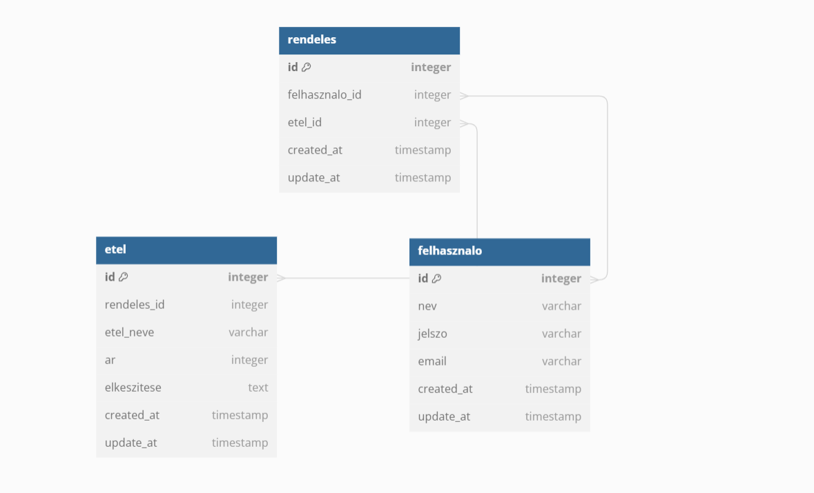

# Rendszerterv

## A rendszer célja
Egy ételrendelős weboldal rendszerének célja az ételrendelés folyamatának lebonyolítása és megkönnyítése mind a felhasználók, mind az étterem tulajdonosok számára. Alapvető céljai közé tartoznak:
Felhasználói élmény javítása: Az oldal célja, hogy egy könnyen használható felületet biztosítson a felhasználók számára, ahol egyszerűen böngészhetik az étlapot, választhatnak és rendelést adhatnak le.
Étterem kínálatának bemutatása: Az étterem lehetőséget kap az étlap, ételek, árak és egyéb speciális ajánlatok online bemutatására, ezzel elérve potenciális vásárlókat.
Rendelés leadása és kezelése: A rendszer lehetővé teszi a felhasználók számára az ételrendelési folyamat egyszerű és gördülékeny lebonyolítását, valamint az étterem számára a rendelések kezelését és feldolgozását.
Kiszállítás és szolgáltatás: Azoknak az éttermeknek, amelyek kiszállítást biztosítanak, a rendszer lehetőséget teremt a szállítási címek kezelésére és a kiszállítási folyamat menedzselésére.
Az ételrendelős weboldal célja az ételrendelési folyamat egyszerűsítése és felhasználóbarát módon történő lebonyolítása mind a vásárlók, mind az étterem tulajdonosok számára, elősegítve ezzel a hatékonyabb ételrendelést és üzletmenetet.

## Projektterv
1. Projektdefiníció és előkészületek
Célkitűzések meghatározása: Részletesen megfogalmazott célok, amelyek az ételrendelős weboldal elkészítésével elérhetők.
Projektcsapat összeállítása: Részvétel szakemberekkel (fejlesztők, dizájnerek, projektmenedzserek stb.).
Részletes követelmények meghatározása: Funkcionális és nem-funkcionális követelmények összegyűjtése.
2. Tervezési fázis
Felhasználói felület tervezése: Dizájn, felhasználói élmény tervezése.
Funkcionális tervezés: Részletes funkcionális specifikációk elkészítése.
Adatmodell kialakítása: Az adatbázis struktúrájának tervezése az ételrendelési folyamat támogatására.
3. Fejlesztési fázis
Frontend fejlesztés: Az oldal felhasználói felületének kialakítása HTML, CSS, JavaScript stb. segítségével.
Backend fejlesztés: Az üzleti logika és az adatkezelés fejlesztése különböző programozási nyelvekkel (pl. Python, Node.js, stb.) és keretrendszerekkel.
Adatbázis implementációja: Az adatbázis struktúrájának kialakítása és az adatbázis beállítása.
4. Tesztelési fázis
Egységtesztelés: A kód egyes részeinek és funkcióinak tesztelése.
Funkcionális tesztelés: Az összes funkció, modul és az egész rendszer teljesítményének és működésének tesztelése.
Felhasználói tesztelés: Kiválasztott felhasználók bevonása a tesztelésbe a felhasználói élmény és funkcionalitás ellenőrzésére.
5. Bevezetés és karbantartás
Élesítés: Az oldal nyilvánosan elérhetővé tétele és beindítása.
Felhasználók oktatása: Szükség esetén oktatás vagy támogatás biztosítása a felhasználók számára az oldal használatához.
Karbantartás és frissítések: Rendszeres karbantartás, hibajavítások, frissítések és fejlesztések végrehajtása az oldal stabil működése és fejlődése érdekében.

## Üzleti folyamatok modellje
Kosárba helyezés és rendelés összeállítása:
Folyamat: A felhasználók kiválasztják a kívánt ételeket és azokat a kosárba helyezik a rendelés összeállítása érdekében.
Funkcionalitások:
Ételek kosárba helyezése, módosítása (mennyiség, törlés).
Kosár tartalmának megtekintése és rendelés véglegesítése.

Rendelés leadása és fizetés:
Folyamat: A felhasználók megadják a szállítási címet, fizetési információkat és leadják a rendelést.
Funkcionalitások:
Szállítási cím megadása, kívánt időpont kiválasztása.
Fizetési módok választása és fizetés (bankkártya, online fizetés, készpénz stb.).

Rendelés feldolgozása és kiszállítás/elvétel:
Folyamat: Az étterem kapja a rendelést, feldolgozza és kiszállítja a megfelelő címre vagy az ügyfél átveszi az étteremben.
Funkcionalitások:
Étterem számára rendelés visszaigazolása, készítés és csomagolás.
Futárszolgálat intézése a kiszállításhoz, vagy értesítés az elvételre.

Rendelés státuszának nyomon követése és visszaigazolás:
Folyamat: A felhasználók nyomon követik a rendelés állapotát és kapnak értesítést a kiszállítás/elvétel időpontjáról.
Funkcionalitások:
Rendelés állapotának nyomon követése a weboldalon vagy mobilalkalmazáson keresztül.
Automatikus értesítések a rendelés státuszáról (folyamatban, kiszállítás alatt stb.).

Értékelés és visszajelzés:
Folyamat: A felhasználók lehetőséget kapnak az étterem, az ételek vagy a szolgáltatás értékelésére és vélemény megosztására.
Funkcionalitások:
Értékelés és vélemény megosztása az étteremről vagy az ételekről.
Rendszeres visszajelzéskezelés és felhasználói értékelések kezelése.
Ezek a folyamatok és funkciók egy ételrendelős weboldal rendszertervi üzleti folyamatait képviselik, amelyeket az adott weboldal fejlesztése során implementálni lehet a felhasználói élmény javítása és a hatékony rendelési folyamat biztosítása érdekében.

## Követelmények

A weboldal létrehozásához HTML/CSS illetve JavaScriptet és PHP-t használtunk. A felépítés és dizájnolás HTML és CSS implementálásával történik. Az oldal teljes értékű felhasználására elegendő egy egyszerű internetes böngészőt indítanunk. A keretrendszer amit használunk a projekthez a Node.js

## Funkcionális terv
**Felhasználói Regisztráció és Belépés:**
Felhasználók regisztrálhatnak egy fiókot az oldalon, vagy beléphetnek már meglévő fiókjukkal.
Regisztrált felhasználók számára elérhetővé válnak a kiegészítő funkciók (ajánlatok megosztása, receptek feltöltése).

**Ételböngészés és Kiválasztás:**
A felhasználók könnyedén böngészhetik az étlapot, szűrhetik és kereshetik az ételeket.
Minden ételnek részletes profilja legyen elérhető, beleértve nevet, leírást, árat, összetevőket és allergén információkat.

**Kosár Kezelése:**
Felhasználóknak lehetőségük van ételek kosárba helyezésére.
Rugalmas szerkesztési lehetőségek a kosárban, beleértve mennyiség módosítását, étel eltávolítását vagy új ételek hozzáadását.

**Rendelési Folyamat:**
Egyszerű rendelési folyamat biztosítása, beleértve a kosár tartalmának ellenőrzését és módosítását.
Rendelés véglegesítése és megerősítése a felhasználónak.

**Étterem Adatok és Kínálat:**
Étterem számára lehetőség az étlap, ételek, árak és speciális ajánlatok online frissítésére.
Az étterem számára admin felület a rendelések kezelésére és feldolgozására.

**Felhasználói Élmény és Design:**
Modern, vonzó és felhasználóbarát design biztosítása az oldal számára.
Az oldal egyszerű és intiutív navigációval rendelkezzen a felhasználók kényelméért.

## Fizikai környezet

Az ételrendelős weboldal működéséhez és üzemeltetéséhez szükséges fizikai környezet különböző elemekből állhat:

1. Szerverpark és adatközpont:

A weboldal működtetéséhez szerverekre van szükség, amelyek tárolják az adatbázist és kezelik a weboldal funkcionalitását.
Adatközpontok lehetnek különféle helyeken, ahol a szerverek futnak, az adatok tárolódnak és a weboldal számára biztosított hálózati kapcsolatok vannak.
Az új funkciók és frissítések fejlesztéséhez szükséges fejlesztői környezet, amely lehetőséget biztosít a weboldal kódjának és funkcionalitásának tesztelésére.
Az üzemeltetéshez szükséges eszközök és rendszerek, amelyek segítik a weboldal folyamatos működését és karbantartását.
Ügyfélszolgálati és támogató rendszerek:Az ügyfélszolgálati tevékenységek támogatása érdekében szükség lehet call center-re vagy online üzenetküldő platformokra, ahol az ügyfelek kérdéseire és problémáira válaszolnak.Fontos része a fizikai környezetnek a rendszeres adatmentés és visszaállítás lehetősége, ami biztosítja az adatvesztés minimalizálását és az üzemképesség fenntartását esetleges katasztrófák vagy hibák esetén.Ezek az elemek alkotják az ételrendelős weboldalunk fizikai környezetét, amelyek az online platform működését és biztonságát biztosítják a felhasználók számára. Fontos, hogy ezek a rendszerek megfeleljenek az adatvédelmi és biztonsági előírásoknak annak érdekében, hogy a felhasználók adatai védettek legyenek és a weboldal zavartalanul működjön.

## Adatbázis terv

## Tesztterv

### Tesztelési eljárások
#### Unit teszt:
A fejlesztés során fontos, hogy minél korábban kezdjünk el tesztelni annyira, amennyire csak lehetséges. Ennek érdekében minden egyes metódushoz egységteszteket kell írnunk annak érdekében, hogy biztosítsuk megfelelő működésüket. Az egységtesztek segítenek abban, hogy minél több kódot ellenőrizzünk és lefedjünk, ezzel növelve a kód megbízhatóságát. A metódusok akkor tekinthetők készen állónak, amikor az őket tesztelő tesztesetek hibamentesen lefutnak, így biztosítva a funkcionalitás stabilitását.

#### Alfa teszt:
  A fő célja a tesztelésnek az, hogy ellenőrizzük a meglévő funkciók működését különböző böngészőkben és Android eszközökön. A fejlesztők végzik el ezt a tesztet. A teszt akkor tekinthető sikeresnek, ha a különböző funkciók megfelelően működnek a különböző böngészőkben és Android eszközökön is. Az ellenőrzés időtartama egy hét lesz.

#### Béta teszt:
Ezt a tesztet nem a fejlesztők végzik el.
Tesztelendő böngészők: Opera, Firefox, Google Chrome, Safari

## Telepítési terv

A szoftver webes felületéhez csak egy ajánlott böngésző telepítése
szükséges (Google Chrome, Firefox, Opera), külön szoftver
nem kell hozzá. A webszerverre közvetlenül az internetről
kapcsolódnak rá a kliensek.

## Implementációs terv

A webes felület főként HTML, CSS és JavaScript nyelven épül fel, és az ezekhez tartozó kódrészleteket külön fájlokba szervezzük. Ezt azért tesszük, hogy jobban átlátható legyen a struktúra, könnyebben lehessen módosítani és könnyebben bővíthető legyen. Emellett a felület képes lesz kommunikálni a backend részen futó REST szolgáltatásokkal, így lehetőség lesz adatok felvitelére és lekérésére az adatbázisból. A felhasználói élményt tovább fokozzuk azzal, hogy az eltelt időt a kliens oldalon számoljuk a feladatoknál, így minimalizálva az esetleges időeltéréseket.

## Karbantartási terv

Az alkalmazás folyamatos működtetése és karbantartása kiemelten fontos, magában foglalva a programhibák javítását, belső igények változásából adódó módosításokat, valamint az környezeti feltételek változásából fakadó program- és állománymódosításokat. Fontos ellenőrizni, hogy az alkalmazás kompatibilis-e a későbbi frissített webes verziókkal. Emellett az idő előrehaladtával új kategóriákat kell hozzáadnunk az alkalmazáshoz, hogy fenntartsuk az érdeklődést és frissességet.
